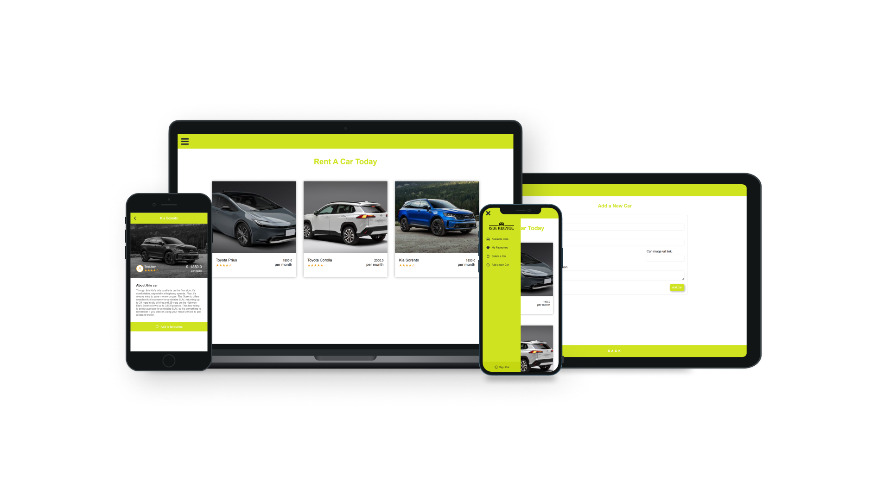

<a name="readme-top"></a>

# 📗 Table of Contents

- [📖 About the Project](#about-project)
  - [🛠 Built With](#built-with)
    - [Tech Stack](#tech-stack)
    - [Key Features](#key-features)
- [💻 Getting Started](#getting-started)
  - [Setup](#setup)
  - [Prerequisites](#prerequisites)
  - [Install](#install)
  - [Usage](#usage)
  - [Run tests](#run-tests)
- [👥 Authors](#authors)
- [🔭 Future Features](#future-features)
- [🤝 Contributing](#contributing)
- [⭐️ Show your support](#support)
- [🙏 Acknowledgements](#acknowledgements)
- [📝 License](#license)

# 📖 [Car Rental App] <a name="about-project"></a>

<div align="center">
  
  <br/>

  <h3><b>Car Rental App</b></h3>

</div>

> The **Car Rental App** is a comprehensive full-stack application where you can seamlessly explore an array of cars, search by name, delve into comprehensive car details, make reservations when logged in, manage reservations, add or delete cars in the database, and personalize your profile with ease. Built with React, Redux as Front-end and Ruby on Rails, PostgreSQL as Back-end API.

- You can see the Front-end repo <a href="https://github.com/Rhaegar121/Car-Rental-front-end">here</a>.

## 🛠 Built With <a name="built-with"></a>

### Tech Stack <a name="tech-stack"></a>

<details>
  <summary>Client</summary>
  <ul>
    <li><a href="https://reactjs.org/">React.js</a></li>
    <li><a href="https://redux.js.org/">Redux</a></li>
  </ul>
</details>

<details>
  <summary>Server</summary>
  <ul>
    <li><a href="https://rubyonrails.org/">Ruby on Rails</a></li>
    <li><a href="https://www.postgresql.org/">PostgreSQL</a></li>
  </ul>
</details>

### Key Features <a name="key-features"></a>

- Car Listings
- Car Details
- Reservations
- Car Deletion
- Car Addition
- Profile Management

## 💻 Getting Started <a name="getting-started"></a>

To get a local copy up and running, follow these steps.

### Prerequisites

In order to run this project you need:

- Command line or terminal with Rails installed.
- IDE such as VsCode.

### Setup

Clone this repository to your desired folder:

```sh
  cd my-folder
  https://github.com/Rhaegar121/Car-Rental-back-end
```

### Install

Install this project with:

Example command:

```sh
  cd my-project
  gem install rails
  gem install ruby
  gem install bundler
  bundle install
```
```
  rails db:create, 
  rails db:migrate, 
  rails db:seed
```

### Usage

To run the project, execute the following command:

```sh
  rails server
```

### Test

To check the tests, execute the following command:

```sh
  rspec ./spec/models
  rspec ./spec/controllers
```

## 👥 Author <a name="authors"></a>

👤 **Rachel Issac**

- GitHub: [Rachelwebdev](https://github.com/Rachelwebdev)
- Twitter: [@rachelisaac13](https://twitter.com/Rachelisaac13)
- LinkedIn: [Rachel Isaac](https://www.linkedin.com/in/rachelisaac13/)

👤 **Kaung Myat Kyaw**

- Portfolio: [rhbarry.me](https://rhbarry.me)
- GitHub: [Rhaegar121](https://github.com/Rhaegar121)
- Twitter [Rhaegar121](https://twitter.com/Rhaegar121)
- LinkedIn: [Kaung Myat Kyaw](https://www.linkedin.com/in/kaungmyatkyaw/)

👤 **Jerome Jay Osman**

- GitHub: [@Jay Jerome G.O.](https://github.com/187jjay187)
- LinkedIn: [Jerome Osman](https://www.linkedin.com/in/)

👤 **Innocent N.**

- GitHub: [@chaseknis](https://github.com/Chaseknis/)
- Twitter: [@ChaseToTheWorld](https://twitter.com/chasetotheworld)
- LinkedIn: [Innocent N.](https://www.linkedin.com/in/innocent-n-200826252/)

## 🔭 Future Features <a name="future-features"></a>

- **[Image_uploading_with_ActiveStorage]**
- **[Token_based_authentication]**

## 🤝 Contributing <a name="contributing"></a>

Contributions, issues, and feature requests are welcome!

Feel free to check the [issues page](../../issues/).

## ⭐️ Show your support <a name="support"></a>

If you like this project...give it a ⭐️!

## 🙏 Acknowledgments <a name="acknowledgements"></a>

This replica was originally designed by <a href="https://www.behance.net/alexey_savitskiy">Alexey Savitskiy in Behance</a>. Checkout Gregoire Vella's design <a href="https://www.behance.net/gallery/37706679/Circle-(Landing-page-Dashboard-Mobile-App)">here</a>

## 📝 License <a name="license"></a>

This project is [MIT](./MIT.md) licensed.

<p align="right">(<a href="#readme-top">back to top</a>)</p>